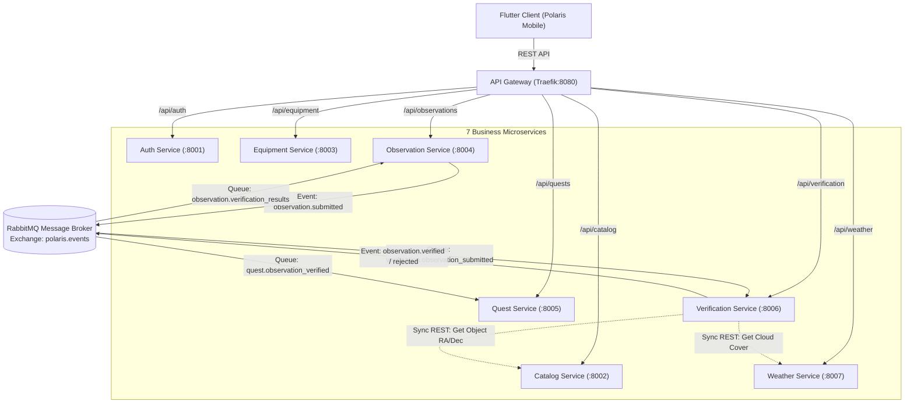
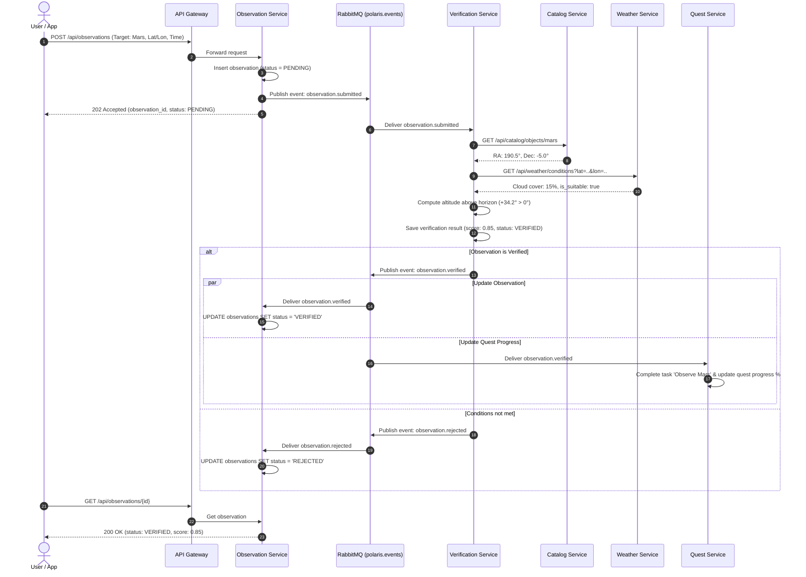

# Архитектурные диаграммы Polaris

## Диаграмма компонентов и взаимодействия

```mermaid
flowchart TD
    Client["Flutter Client (Polaris Mobile)"]
    Gateway["API Gateway (Traefik:8080)"]

    subgraph Business_Microservices["7 Business Microservices"]
        Auth["Auth Service (:8001)"]
        Catalog["Catalog Service (:8002)"]
        Equipment["Equipment Service (:8003)"]
        Observation["Observation Service (:8004)"]
        Quest["Quest Service (:8005)"]
        Verification["Verification Service (:8006)"]
        Weather["Weather Service (:8007)"]
    end

    Broker[("RabbitMQ Message Broker\nExchange: polaris.events")]

    Client -->|REST API| Gateway
    Gateway -->|/api/auth| Auth
    Gateway -->|/api/catalog| Catalog
    Gateway -->|/api/equipment| Equipment
    Gateway -->|/api/observations| Observation
    Gateway -->|/api/quests| Quest
    Gateway -->|/api/verification| Verification
    Gateway -->|/api/weather| Weather

    Observation -->|Event: observation.submitted| Broker
    Broker -->|Queue: verification.observation_submitted| Verification

    Verification -.->|Sync REST: Get Object RA/Dec| Catalog
    Verification -.->|Sync REST: Get Cloud Cover| Weather

    Verification -->|Event: observation.verified / rejected| Broker
    Broker -->|Queue: observation.verification_results| Observation
    Broker -->|Queue: quest.observation_verified| Quest
```

---

## Диаграмма последовательности: Асинхронная верификация наблюдений

```mermaid
sequenceDiagram
    autonumber
    actor User as User / App
    participant GW as API Gateway
    participant Obs as Observation Service
    participant MQ as RabbitMQ (polaris.events)
    participant Ver as Verification Service
    participant Cat as Catalog Service
    participant Wea as Weather Service
    participant Qst as Quest Service

    User->>GW: POST /api/observations (Target: Mars, Lat/Lon, Time)
    GW->>Obs: Forward request
    Obs->>Obs: Insert observation (status = PENDING)
    Obs->>MQ: Publish event: observation.submitted
    Obs-->>User: 202 Accepted (observation_id, status: PENDING)

    MQ->>Ver: Deliver observation.submitted
    Ver->>Cat: GET /api/catalog/objects/mars
    Cat-->>Ver: RA: 190.5°, Dec: -5.0°
    Ver->>Wea: GET /api/weather/conditions?lat=..&lon=..
    Wea-->>Ver: Cloud cover: 15%, is_suitable: true
    Ver->>Ver: Compute altitude above horizon (+34.2° > 0°)
    Ver->>Ver: Save verification result (score: 0.85, status: VERIFIED)

    alt Observation is Verified
        Ver->>MQ: Publish event: observation.verified
        par Update Observation
            MQ->>Obs: Deliver observation.verified
            Obs->>Obs: UPDATE observations SET status = 'VERIFIED'
        and Update Quest Progress
            MQ->>Qst: Deliver observation.verified
            Qst->>Qst: Complete task 'Observe Mars' & update quest progress %
        end
    else Conditions not met
        Ver->>MQ: Publish event: observation.rejected
        MQ->>Obs: Deliver observation.rejected
        Obs->>Obs: UPDATE observations SET status = 'REJECTED'
    end

    User->>GW: GET /api/observations/{id}
    GW->>Obs: Get observation
    Obs-->>User: 200 OK (status: VERIFIED, score: 0.85)
```
